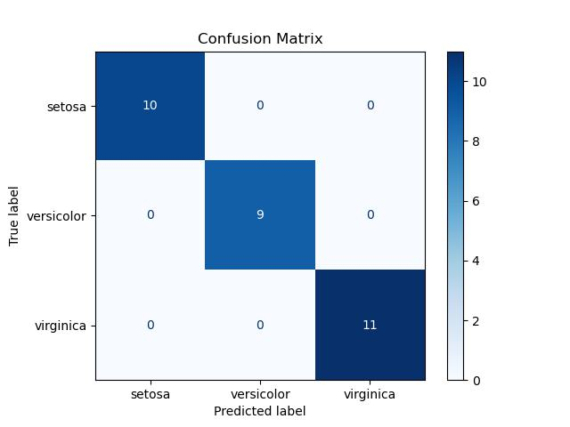

# 🧠 Simple ML Project: Iris Classification

This project demonstrates a complete machine learning workflow using the classic **Iris flower dataset**. It covers:

- Data loading
- Data visualization
- Model training (Logistic Regression)
- Evaluation with metrics and confusion matrix
- Final plot embedded below

---

## 📊 Sample Output: Confusion Matrix



---

## 🗂️ Project Structure

```
simple-ml-project/
│
├── notebooks/              # Main Jupyter notebooks
│   └── simple_ml_project.ipynb
├── data/                   # (Empty for now - using sklearn dataset)
├── src/                    # Placeholder for reusable code
│   └── README.md
├── confusion_matrix.png    # Output image used in README
└── README.md               # Project overview
```

---

## ⚙️ Setup Instructions

### 📦 Create Environment

```bash
conda create -n mlenv python=3.11 jupyterlab pandas numpy matplotlib scikit-learn seaborn -y
conda activate mlenv
```

### 🚀 Launch JupyterLab

```bash
jupyter lab
```

Then open `notebooks/simple_ml_project.ipynb`.

---

## 🧪 Workflow Summary

- ✅ Load the Iris dataset using `sklearn.datasets`
- ✅ Explore and visualize the features using `seaborn`
- ✅ Split the data and scale features using `StandardScaler`
- ✅ Train a **Logistic Regression** classifier
- ✅ Evaluate accuracy and plot the confusion matrix

---

## 📝 Notes

- Dataset used is from `sklearn.datasets`, so no external files required.
- `data/` and `src/` folders are ready for expansion if needed.
- Confusion matrix image is auto-generated from the notebook.

---

## 🌐 License & Contributions

Free to use and extend. Contributions welcome!
